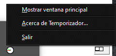
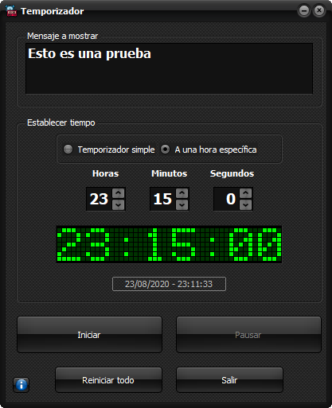
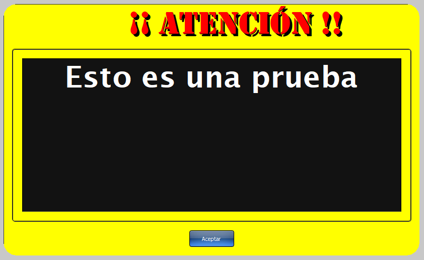
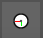
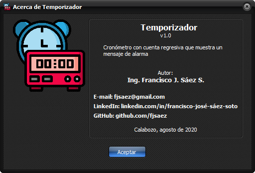

# Temporizador

---

## Descripción

Aplicación que actúa como un cronómetro regresivo, y que al finalizar el tiempo al que fue configurado, muestra una pantalla con un mensaje. La utilidad de esta aplicación reside en dar un aviso para evitar olvidar cosas cuando se está inmerso en actividades en la PC.

## Modo de uso

* Escribir el mensaje o aviso a mostrar en el memo de "Mensaje a mostrar".
* Seleccionar si es "Temporizador simple" o "A una hora específica". En este último caso, simplemente seleccionar la hora a la que sonará la alarma.
* Establecer el tiempo (horas, minutos y segundos).
* Pulsar en el botón "Iniciar". A partir de ese momento comienza la cuenta regresiva.

En el icono de la barra de tareas se puede hacer click derecho y muestra un menú.

## Notas

* El máximo de tiempo a configurar es 11:59:59 (modo Temporizador simple).
* Compilado sólo para 32 bits.
* Totalmente funcional.

---

## Lenguaje/framework/base de datos

* Lenguaje: Delphi 10.2 Tokyo. 
* Framework: VCL. 
* Además de los nativos, se emplearon componentes Raize y Essentials.

---

## Instalación

No requiere de instalación y es totalmente portable.

---

## Autor

Ing. Francisco José Sáez Soto.

e-mail: **fjsaez@gmail.com**

LinkedIn: **linkedin.com/in/francisco-josé-sáez-soto**

GitHub: **github.com/fjsaez**

---

Calabozo (Venezuela), agosto de 2020.

---

## Imágenes de la aplicación

### Icono

### Pantalla principal

### Pantalla de mensaje

### Icono de barra de tareas

### Acerca...

